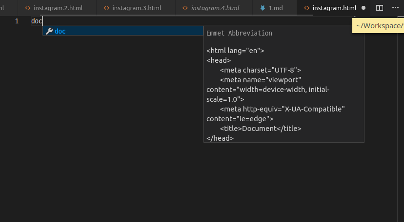
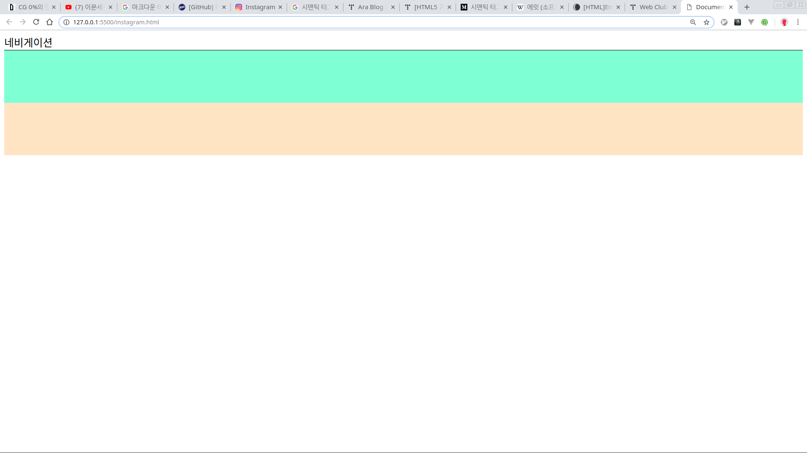
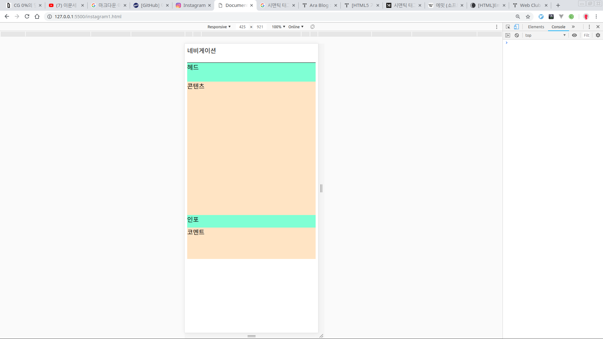

# 인스타그램 클론코딩1

완전 기초부터 설명할테니 지겨우면 알아서 넘겨서 보라.

1. 파일만들기
2. 기본 html 틀 잡기
3. 기본 구성 만들기

## 파일만들기

새 파일 만들고 이름은 'instagram.html'이라고 짓는다.

**'.html' 확장자를 꼭 붙여라**  
**확장자 안붙이고 작업하면 html파일도 일단 그 파일은 html파일도 아니거니와 vscode가 그 파일을 html이라고 인식을 못한다.**

_Tip 'doc'를 입력하고 \[Tap\]키를 누르면 아래와 같이 나올 것이다.  
이렇게 웹 작업을 할 때 유용한 도구이다.  
만약에 안나오면 확장기능 중 'HTML CSS Support'를 설치하면 된다.  
자세한 설명은 아래의 링크를 참조하라_  
[https://nachwon.github.io/How\_to\_use\_emmet/](https://nachwon.github.io/How_to_use_emmet/)  
[https://webclub.tistory.com/161](https://webclub.tistory.com/161)



아래와 같이 기본 html이 구성되었을 것이다.

## HTML 틀잡기

```markup
<!-- instagram.html -->
<html lang="en">
<head>
  <meta charset="UTF-8">
  <meta name="viewport" content="width=device-width, initial-scale=1.0">
  <meta http-equiv="X-UA-Compatible" content="ie=edge">
  <title>Document</title>
</head>
<body>

</body>
</html>
```

그럼 `<body></body>` 태그 안에다가 기초적인 틀을 잡아보자.

인스타 기본 포스트는 이렇게 생겼다.


**참고로 내 동생이라 무단도용아님**

### 구조살펴보기

구조를 살펴보면 대충 아래와 같다.

* 네비게이션
* 포스트
  * 포스트 헤드
  * 포스트 콘텐츠
  * 포스트 인포메이션
  * 포스트 코멘트

이것을 코드로 옮기자.  
원래 `<div></div>`대신 `<section></section>` 또는 `<nav></nav>`라고 시멘틱 태그를 쓰면 좋긴한데. 일단은 넘어가자. 별 의미없다. 궁금하면 아래 참조하도록

{% embed url="https://hunit.tistory.com/172%0Ahttps://medium.com/@Gomtang/시맨틱-태그란-331bdcd3e43d" caption="" %}

### 구조 html로 구성하기

```markup
<body>
  <div class="navigation">
    네비게이션
  </div>
  <div class="post">
    <div class="post-head"></div>
    <div class="post-contents"></div>
    <div class="post-infor"></div>
    <div class="post-comment"></div>
  </div>
</body>
```

그리고 일단 전체적인 틀을 잡자. 어차피 지금 잡은 틀은 나중가서 다 고쳐야 하지만  
전체적인 틀이 있으면 작업할 때 편하다.

## CSS로 레이아웃 구성하기

css를 아래와 같이 작업한다.

```css
.navigation {
      background-color: white;
      border-bottom: 1px solid black;
    }

    .post-head {
      height: 60px;
      background-color: aquamarine;
    }

    .post-contents {
      height: 425px;
      background-color: bisque;
    }

    .post-infor {
      height: 40px;
      background-color: aquamarine;
    }

    .post-comment {
      height: 100px;
      background-color: bisque;
    }
```

결과는 이렇게 나오면 된다. 항상 개발자 도구로 해서 mobilL 사이즈로 확인바란다.  

이러면 일단 1단계 끝.

## 끝내기전에

끝내기전에 추천하는 팁들

아래와 같은 확장기능 추천한다.

* HTML Snippets
* intelliSense for CSS class names in HTML

다시 한번 확인할 것들

* 저장을 습관하라. 수정하면 걍 \[Ctrl + S\]를 수시로 눌러라. 어차피 \[Ctrl + z\]하면 전에 한 작업으로 되돌아 간다.
* 자동완성을 항상 사용하라. 자기 손을 믿지마라.
* 너무 긴 클래스나 변수이름은 걍 복사붙여넣기 해라. 대부분 오류는 오타에서 발생한다.
* 포맷팅을 잘 써라. 사람이 보기 좋은 코드가 오류찾기도 편하다. 편집증있는 사람 아니면 띄어쓰기나 들여쓰기를 완벽하게 할 수 없다.

  \[F1\]눌러서 '&gt;format Document' 이렇게 치면 자동완성 단축키 나올 것이다. 설정 안되있으면 설정하고 수시로 코드정리를 하라.

