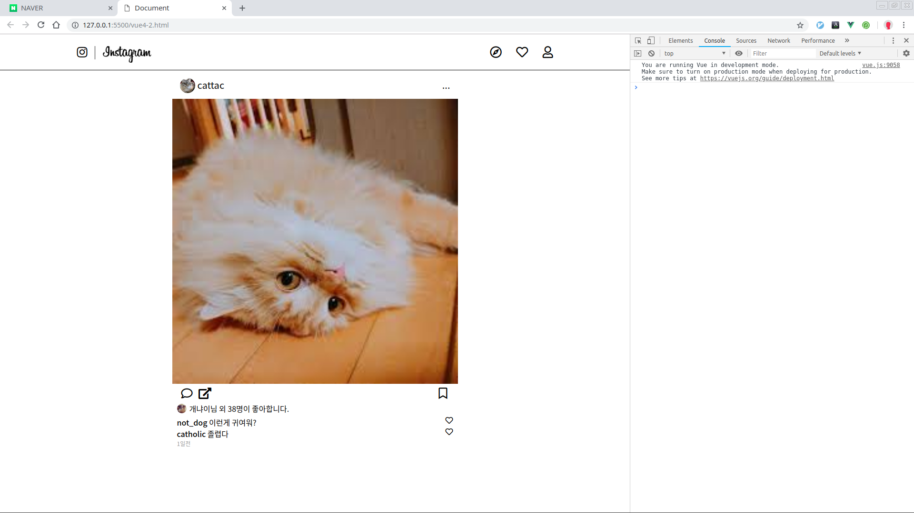

# 인스타그램 클론코딩10

자식 컴포넌트에게 어떻게 데이터를 전달할까?  
가장 기본적인 방법으로는 Props가 있다.  
이 부분은 처음에 이해가 안 될 수도 있지만 몇번 사용하다 보면 이해될 것이다.

자세한건 아래 주소 참조

> [https://kr.vuejs.org/v2/guide/components.html\#Props](https://kr.vuejs.org/v2/guide/components.html#Props)

전에 했던 코드를 수정해보자. 이것은 vue3.html을 수정할 것이다.

```markup
<!-- vue4.html -->
<!-- 번호 순서대로 보자. 조금 복잡하다. -->
<body>
  <div id="app">
    <!--3. 이러면 우리가 text라는 attribute을 추가시킬 수 있다.  -->
    <local-comp text="1번째"></local-comp>
    <local-comp text="두번째"></local-comp>
    <!-- 4. 우리가 만든 attr에도 v-bind를 사용할 수 있다. 
      우리 data에 있는 msg 데이터를 전달해보자.
    -->
    <local-comp :text="msg"></local-comp>
  </div>
  <script src="https://cdn.jsdelivr.net/npm/vue/dist/vue.js"></script>
  <script>
    var localComponent = {
      // 1. props에 배열로 'text'를 추가하자.
      props:['text'],
      // 원래 코드에 {{text}}를 추가했다. 즉 props에서 받은 데이터를 사용한다는 의미이다.
      template: //html
        `<div>이것은 {{ text }}지역 컴포넌트 입니다.</div>`
    }

    var vue = new Vue({
      el: '#app',
      data() {
        return{
          // 5. 위 :text="msg"의 데이터다.
          msg: "hello vue.js"
        }
      },
      components: {
        'local-comp': localComponent
      }
    })
  </script>
</body>
```

그러면 아래와 같이 나올 것이다. !\[10-1\]

이제 우리 코드를 수정하자. 우리 코드도 다 props를 추가하자.

```javascript
// vue4-2.js
...
// 아래처럼 다 props:['post']를 추가하자.
// 자세한건 vue4-2.js 코드를 참고하자.
var postContent = {
  props:['post'],
  tempalte: //html
    `
  <div class="post-contents">
    <div class="post-contents-container" v-for="content in post.contents">
    
    </div>
    </div>
  `
}

...
```

그리고 html도 조금 수정해야 한다.

```markup
<body>
  <div id="app">
    <!--
      1. 아래 Vue의 컴포넌트에 등록한 이름으로 컴포넌트를 쓴다.
     -->
    <navigation></navigation>
    <div class="post">
      <post-head :post="post"></post-head>
      <post-content :post="post"></post-content>
      <post-infor :post="post"></post-infor>
      <post-comment :post="post"></post-comment>
    </div>
  </div>
  <!-- 외부 파일을 가져와야 된다. -->
  <script src="vue4-2.js"></script>
  <script src="https://cdn.jsdelivr.net/npm/vue/dist/vue.js"></script>
  <script>
  // vue4-2.js에 사용한 변수들을 
  // components에 [이름 : 변수]로 등록한다.
    var vue = new Vue({
      el: '#app',
      data: {
        post: postData
      },
      components: {
        'navigation': navigation,
        'post-head': postHead,
        'post-content': postContent,
        'post-infor': postInfor,
        'post-comment': postComment
      }
    })
  </script>
</body>
```

아래처럼 기존과 똑같은 화면이 나와야 한다.

오늘 방법은 vue를 제대로 배우기 앞서 Vue.js의 기본을 연습하기 위한 과정이다.  
다음 강의부터 제대로 vue.js를 써보도록 하자.



