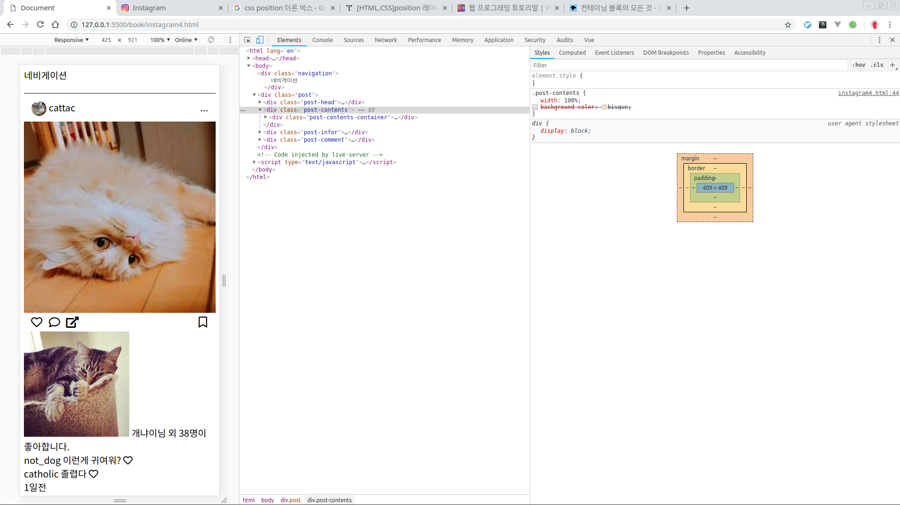
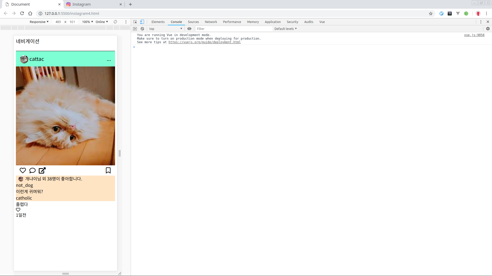
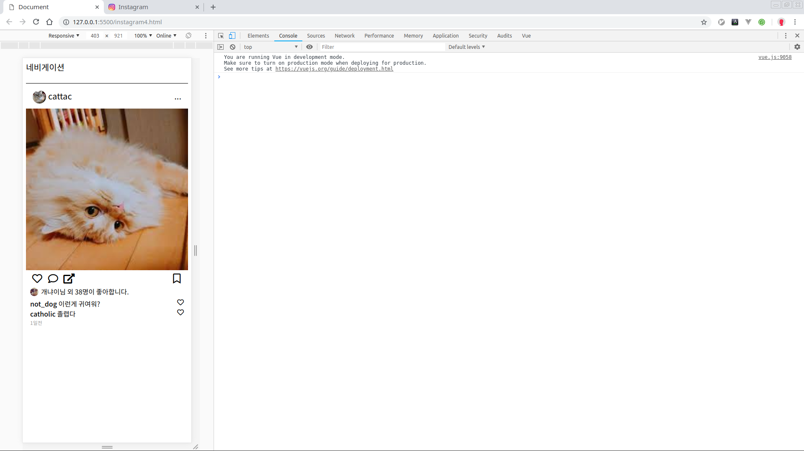

# 인스타그램 클론코딩4

## post-comment

이번엔 포스트의 마지막 post-comment를 만들어보자.


코멘트의 구조를 살펴보자

## 구조짜기

* post-comment
  * post-comment-like\(몇명이 좋아하는지\)
    * post-comment-likeProfile\(프로필이미지\)
    * post-comment-likeNumber\(누구님 몇명 좋아하는지\)
  * post-comment-list\(코멘트는 여러개 있을 것이니깐\)
    * post-comment-item
      * post-comment-itemName
      * post-comment-itemContent
      * post-comment-itemLike
  * post-comment-date\(1일전\)

### HTML 작업

html로 구조를 잡자.

```markup
<div class="post-comment">
  <div class="post-comment-like">
    <div class="post-comment-likeProfile"></div>
    <div class="post-comment-likeNumber"></div>
  </div>
  <div class="post-comment-list">
    <div class="post-comment-item">
      <div class="post-comment-itemName"></div>
      <div class="post-comment-itemContent"></div>
      <div class="post-comment-itemLike"></div>
    </div>
  </div>
  <div class="post-comment-date"></div>
</div>
```

구조를 잡았다면 안에 내용물을 채워보자.

### HTML 내용추가

```markup
<div class="post-comment">
  <div class="post-comment-like">
    <span class="post-comment-likeProfile">
      
    </span>
    <span class="post-comment-likeNumber">
      개냐이님 외 38명이 좋아합니다.
    </span>
  </div>
  <div class="post-comment-list">
    <div class="post-comment-item">
      <span class="post-comment-itemName">
        not_dog
      </span>
      <span class="post-comment-itemContent">이런게 귀여워?</span>
      <span class="post-comment-itemLike">
        <i class="far fa-heart commentBtn"></i>
      </span>
    </div>
    <div class="post-comment-item">
      <span class="post-comment-itemName">
        catholic
      </span>
      <span class="post-comment-itemContent">졸렵다</span>
      <span class="post-comment-itemLike">
        <i class="far fa-heart commentBtn"></i>
      </span>
    </div>
  </div>
  <div class="post-comment-date">1일전</div>
</div>
```

아래와 같이 나올것이다.



## CSS 작업

이제 레이아웃을 잡아보자. 일단 post-comment-like부터 잡으면 이렇다.

### post-comment-like CSS 작업

```css
.post-comment {
  height: 100px;
  background-color: bisque;
  /*
    css 속성의 상하좌우를 입력할 수 있는 많은 속성이 다음고 같이 작성될 수 있다.
    ex) padding : top right bottom left;
    padding : top-bottom right-left;
    padding : all;
    아래는 위아래는 0으로 사이드는 10px로 준것이다.
  */
  padding: 0px 10px;
  /* font 사이즈를 좀 줄이자. */
  font-size: 16px;
}

.post-comment-like {
  /*
    아래 레이아웃을 플렉스로 하고
    수직정렬을 하기 위해
    algin-items에 center를 입력했다.
    flex와 같이 쓰는 속성이
    justify-content: center; 수평정렬
    align-items: center; 수직정렬
    이다. 확실이 수평은 아닌데 일단 이렇게만 알아두자
    */
  display: flex;
  align-items: center;
}

.post-comment-likeImg {
  width: 20px;
  border-radius: 100%;
}

.post-comment-likeNumber {
  padding-left: 6px;
}
```



### post-comment-list CSS 작업

다음은 post-comment-list로 넘어가자.

* 포지션에 대한 좀더 자세한 자료
  * [https://developer.mozilla.org/ko/docs/Web/CSS/All\_About\_The\_Containing\_Block\#컨테이닝\_블록\_식별](https://developer.mozilla.org/ko/docs/Web/CSS/All_About_The_Containing_Block#컨테이닝_블록_식별)

```css
.post-comment-list {
  /* 댓글 리스트는 좀 위와 간격을 주자 */
  padding-top:5px;
}
.post-comment-item{
  /* 
    position을 relative로 주는 이유는 기준박스로 만들기 위함이다.
    일반적으로 position:absolute; 란 값을 주면 배치가 기준박스에서 절대적으로 변하는데 이 때 부모의 position의 값이 relative인 경우
    부모요스의 박스를 기준으로 움직인다.
    이것은 이 값을 꺼보면 확실히 알 수 있다.
  */
  position: relative;
}
.post-comment-itemName{
  /* 폰트의 굵기를 굵게하자 */
  font-weight:500;
}
.post-comment-itemLike{
  /*
    아까와는 다른 방법으로 오른쪽 끝으로 보냈다.
    포지션을 절대배치로 바꾸어 right를 0으로 하면 
    기준박스인 post-comment-item에서 오른쪽 끝으로 이동한다.
  */
  position: absolute;
  right:0px;
}
.commentBtn{
  /* 다른 폰트와 맞추기 위해서 글씨크기를 조절하자. */
  font-size: 100%;
}
.post-comment-date{
  color:#999;
  font-size:10px;
}
```

## 완성

원래 있던 색상을 지우면 아래와 같이 완성될 것이다. 그럼 일단 기본적인 포스트 레이아웃은 완성이다.



