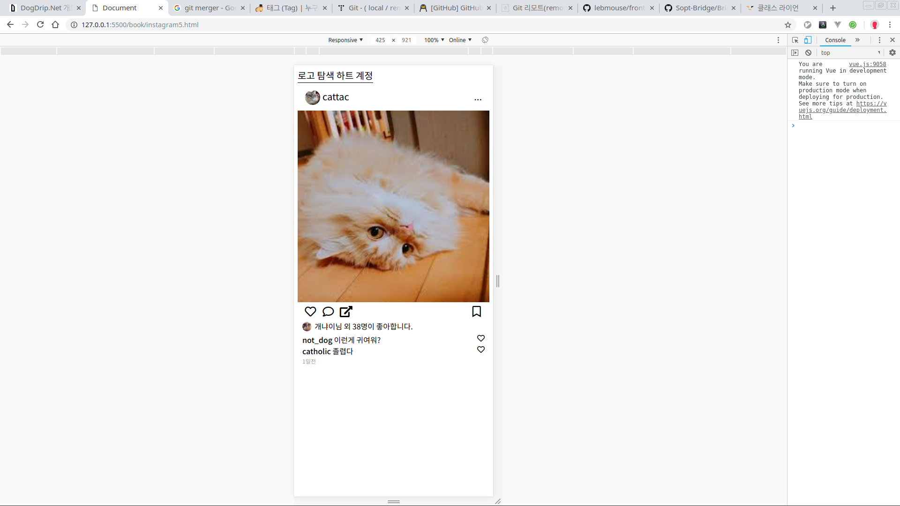

# 인스타그램 클론코딩5

이제 포스트를 만들었으니깐 네비게이셔을 만들도록 하자. 

## 네비게이션 구조

네비게이션의 구조를 보면 살펴보면 이러하다.

* 네비게이션
  * 로고
  * 버튼그룹
    * 탐색
    * 라이크
    * 프로필

      **HTML 구조**

      이것을 html로 구조화 해보자

```markup
<div class="navigation">
  <div class="nav-container">
    <span class="nav-logo">
      로고
      인스트그램
    </span>
    <span class="nav-group">
      <span class="nav-explore">
        탐색
      </span>
      <span class="nav-like">
        좋아요
      </span>
      <span class="nav-profile">
        유저
      </span>
    </span>
  </div>
</div>
```

그리고 글자 대신 아이콘을 넣어보자 폰트 어썸에서 검색하면 된다.

요렇게 추가하자.  
따라치거나 복사붙여넣기 말고 폰트어썸가서 검색해서 붙여넣기 해보자  
[https://fontawesome.com/](https://fontawesome.com/)



```markup
<div class="navigation">
  <div class="nav-container">
    <span class="nav-logo">
      <i class="fab fa-instagram navBtn"></i>
      
    </span>
    <span class="nav-group">
      <span class="nav-explore">
        <i class="far fa-compass navBtn"></i>
      </span>
      <span class="nav-like">
        <i class="far fa-heart navBtn"></i>
      </span>
      <span class="nav-profile">
        <i class="far fa-user navBtn"></i>
      </span>
    </span>
  </div>
</div>
```


## CSS 작업

css 작업을 위해 html을 조금 수정했다.

```markup
<div class="nav-container">
  <span class="nav-logo">
    <i class="fab fa-instagram navBtn"></i>
    <!-- 로고 이미지와 글자 사이에 수직선 추가 -->
    <span class="verticalLine"></span>
    
  </span>
  <span class="nav-group">
    <!-- 컨테이너 추가 -->
    <span class="nav-group-container">
      <span class="nav-explore">
        <i class="far fa-compass navBtn"></i>
      </span>
      <span class="nav-like">
        <i class="far fa-heart navBtn"></i>
      </span>
      <span class="nav-profile">
        <i class="far fa-user navBtn"></i>
      </span>
    </span>
  </span>
</div>
```

```css
네비게이션 css는 원래 조금 복잡하다.
어려운 속성을 쓰지는 않지만 복잡하게 구성한다.
.navigation {
  /* 이제 높이는 필요없다. */
  /* height: 52px; */
  background-color: white;
  border-bottom: 1px solid black;
  /* 간격 좀 띠어보자 */
  padding: 25px 20px 15px 20px;
}

.nav-container {
  /* 로고 브랜드 이미지는 폰트이고
    로고 폰트는 이미지파일이다. 그래서 수직정렬이 잘 안되니깐
    flex로 쉽게 수직정렬을 해보자
    그리고 max-width는 1000px을 주고 margin auto를 주면
    모바일 환경이 아닌 데스크탑 환경에서 볼 때 네비게이션이 가운데로 있는 것을 볼 수 있다.
    다음 단계에선 네비게이션 말고 포스트에도 적용해보자.
     */
  display: flex;
  position: relative;
  max-width: 1000px;
  margin: auto;
}

.navBtn {
  font-size: 25px;
}

.logoFont {
  height: 35px;
}

/* 수직선을 만들기 위해
넓이를 1px 높이를 28px 색을 검정색을 주었다.
 */
.verticalLine {
  width: 1px;
  height: 28px;
  background-color: #262626;
  margin: 0px 16px;
}

.nav-logo {
  display: flex;
  width: 50%;
}
.nav-group-container {
  width: 132px;
  /* 
    자세한건 flex의 사용법을 보면 알겠지만
    justify-content는 아이템들을 수평정렬하는 방법이다.
    space-between은 아이템의 간격을 일정하게 해준다.
    다른 값을 넣어서 눈으로 확인해보자.
   */
  display: flex;
  justify-content: space-between;
  position: absolute;
  right: 0px;
}
```


