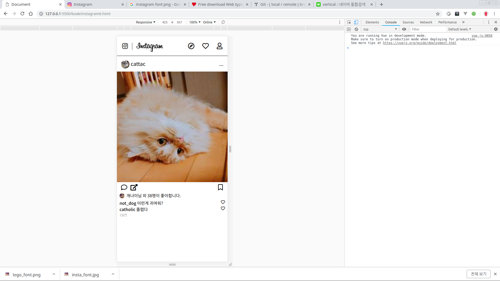
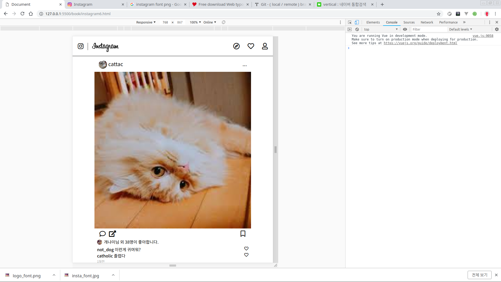
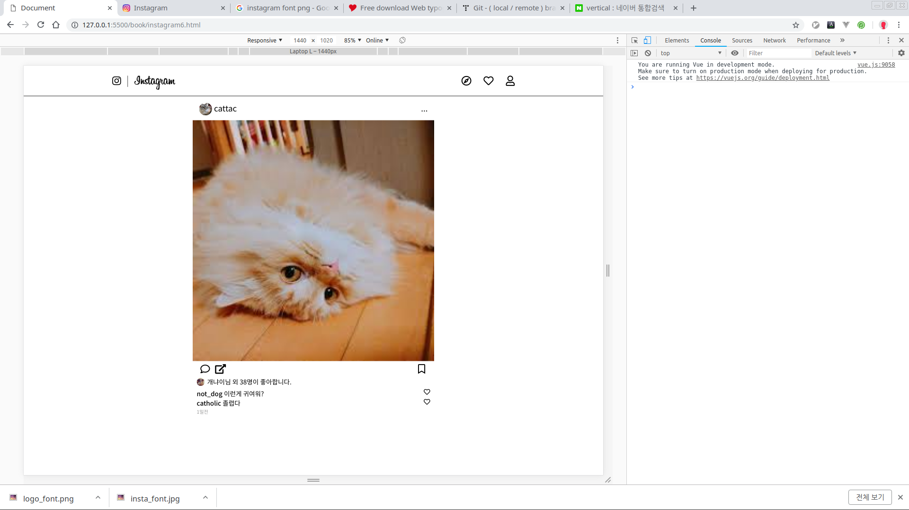
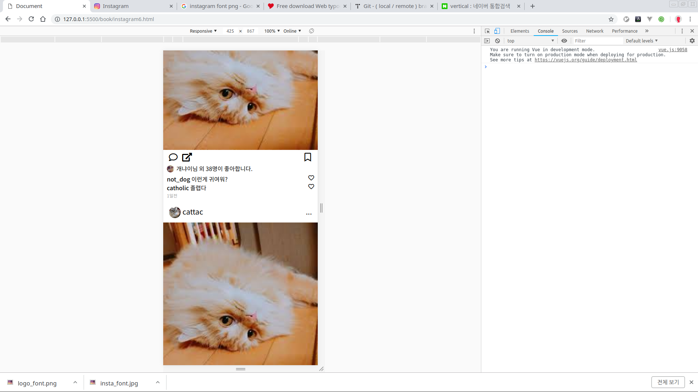

# 인스타그램 클론코딩6

이제 기본 레이아웃 작업을 마무리해보자.

css 정리 좀 해보려고 한다.

```css
/* 보면 페이지에 쓸데없는 간격이 있었을 것이다.
  그것을 없에자.
 */
body{
  margin:0px;
  padding:0px;
}

...
/* 네비게이션처럼 포스트도 반응형으로 만들어보자. */
.post{
  max-width: 600px;
  margin:auto;
}
...
```

이제 다양한 넓이에도 레이아웃이 적응하여 변할 것이다.    

html, css로 레이아웃 잡는 단계가 끝났다.

이제 다음단계로 js를 이용해서 좀 더 동적인 페이지를 만들어보자.

