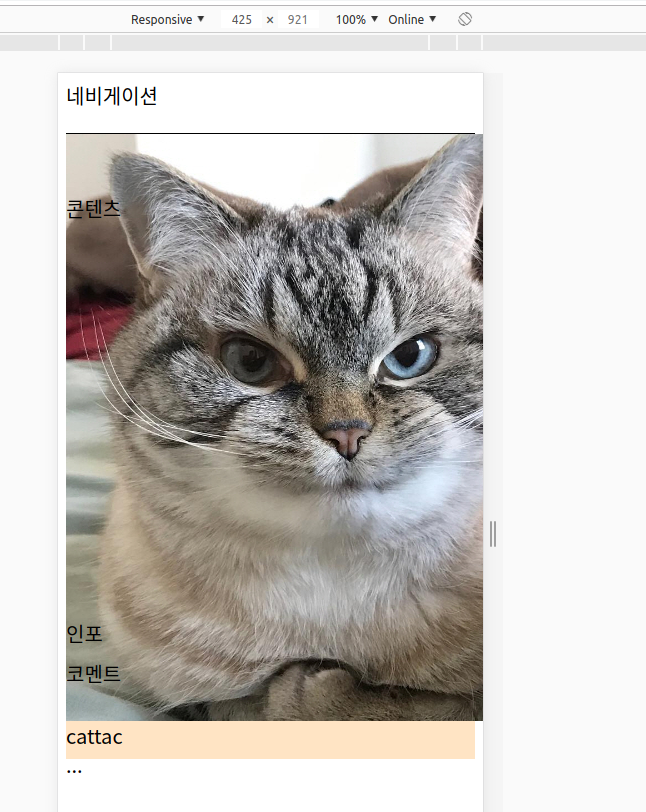
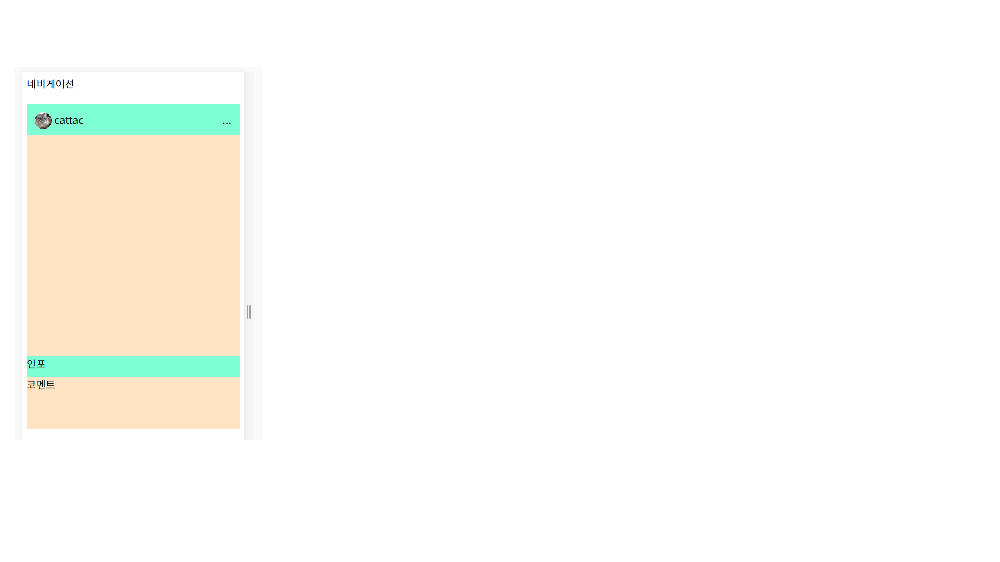
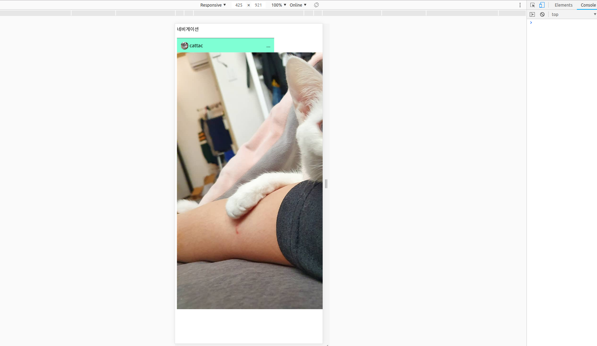
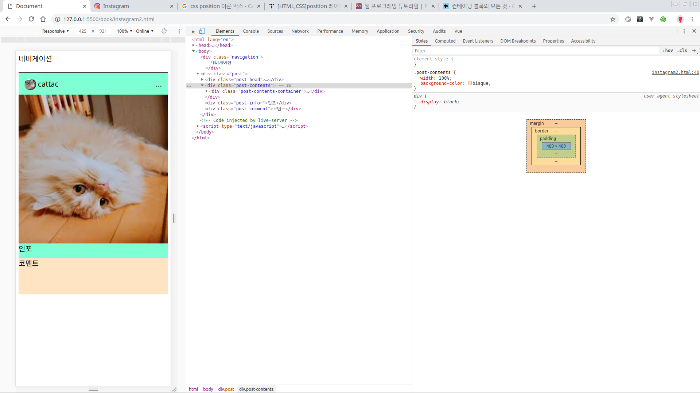

# 인스타그램 클론코딩2

이번 강의에서 할 것은 `post-content` 부분이랑 `post-head` 부분을 할 것이다.

## 2-1 post-head

> **클래스 이름을 왜 이렇게 지었을까?**  
> css는 이름짓는 규칙도 다양하다. 아래의 주소에는 대표적인 3가지 명명규칙이 나와있다.  
> [https://wit.nts-corp.com/2015/04/16/3538](https://wit.nts-corp.com/2015/04/16/3538) [https://www.vobour.com/](https://www.vobour.com/)  
> 이번 프로젝트에서 이름짓는 규칙은 복잡한 규칙말고 그냥 이해하기 쉽고 css를 연습용하기 쉽게 규칙을 정했다.  
> 중첩되는 element의 이름은 '-'을 넣는다. 예를 들어 `<div class="post"></div>` 안에는 `<div class="post-head"></div>`라고 한다. 이래야지 css 작성할 때 알아보기도 편하다.
>
> **오히려 클래스 이름이 너무 더러워진다면?**  
> '-' 너무 중첩하면 오히려 알아보기 힘든데, 나중에 vue.js + scss 란 도구를 사용할 것이기 때문에 일단 이번 프로젝트에서는 신경쓰지 말자. 아래에는 css 이름규칙에 대한 추천 자료들이다.  
> [https://www.vobour.com/-css-디버깅-시간을-절약-할-수있는-css-명명-규칙](https://www.vobour.com/-css-디버깅-시간을-절약-할-수있는-css-명명-규칙)

post-head 부분을 이렇게 바꾸어라.  
이미지는 인터넷에서 정사각형 모양의 사진으로 찾아서.  
작업영역에 폴더를 만들어 다운받아 사용하자. 찾기귀찮으면 강의자료에 있는 사진을 활용해도 된다.

### html 작업

```markup
<div class="post-head">
  <!-- container는 일반적으로 레이아웃을 잡기 위해 감싸주는 클래스로 사용된다. -->
  <div class="post-head-container">
    <!-- 프로필 이미지를 넣기 위한 클래스 -->
    <div class="post-head-profile">
      <!--
        그 안에 이미지 클래스 
        '-'을 너무 많이 쓰면 더러우니깐 '-' 하이픈 대신
        단어 앞 글자를 대문자로 해서 클래스이름을 지었다.
        이렇게 이름 이름을 짓는 것을 camelCase라 한다.
        첫 단어는 소문자로 시작하고 이어지는 단어의 첫 글자는 대문자로 하는 모양이 
        낙타의 혹과 같다 해서 camelCase라 한다.
      -->
      
    </div>
    <!-- 이름을 나타내는 클래스 -->
    <div class="post-head-name">cattac</div>
    <!-- 나중에 버튼으로 사용할 것이기 때문에 버튼이라고 하자 -->
    <div class="post-head-btn">...</div>
  </div>
</div>
```

그러면 아래와 같이 뜰것인데 이미지가 너무 클것이다. css를 만져주지 않아서 그렇다.



프로필 헤드 전체 css는 아래와 같다. 첨부터 다 따라치지 말고.  
클래스별로 치면서 어떻게 화면이 바뀌는지 확인하자. 또 속성을 지워보거나 속성에 다른 값을 줘서 어떻게 변화하는지도 확인해보자.

### CSS 작업

### 아래에 쓴 속성\(property\)에 대한 자료들

* display
  * [https://ofcourse.kr/css-course/display-속성](https://ofcourse.kr/css-course/display-속성)  
* flexbox
  * [https://developer.mozilla.org/ko/docs/Web/CSS/CSS\_Flexible\_Box\_Layout/Flexbox의\_기본\_개념](https://developer.mozilla.org/ko/docs/Web/CSS/CSS_Flexible_Box_Layout/Flexbox의_기본_개념)  
  * [https://d2.naver.com/helloworld/8540176](https://d2.naver.com/helloworld/8540176)  
* position
  * [https://ko.learnlayout.com/position.html](https://ko.learnlayout.com/position.html)
* css 단위에 대해서
  * [https://mainia.tistory.com/3894](https://mainia.tistory.com/3894)
  * [https://webdir.tistory.com/414](https://webdir.tistory.com/414)

```css
.post{
  ...
}

.post-head {
  height: 60px;
  background-color: aquamarine;
}

.post-head-container {
  /* 
  display는 어떻게 표시할지를 정하는 속성인데
  예를 들어 div는 기본적으로 block이고 span은 inline이다.
  우리는 flex layout을 하기 위해 flex를 준다.
   */
  display: flex; 
  /* 
    position은 엘레먼트의 자리를 잡는 속성이다.
    대표적으로 relative, absolute, fixed, etc가 있다.
    기본 값은 static이고 relative는 다른 값이 없는 한 static이란 같은 효과를 준다.
    하지만 relative는 top,bottom,left,right와 같은 값으로 좌표를 엘레먼트를 움직일 수 있다.  
    또한 자식엘레먼트들의 위치를 자신으로 고정시킬 수 있다. 이건 나중에 이야기 함.
   */
  position: relative;
  /* padding은 말그대로 padding 충전재이다. 자세한건 css box-model을 참고 */
  padding: 16px;
}

.post-head-profile {
  /* 동그랑 원을 만들거기 때문에 높이와 너비를 같게 주자. */
  width: 32px;
  height: 32px;
}

.post-head-profileImg {
  /* 
  이 크랠스는 .post-head-profile 안에 작성되어있다.
  그래서 width:100%는 상대단위로 부모요소의 너비에서 100%를 가진다는 말이다.
  css 단위는 절대단위와 상대단위가 있는데 일단 절대단위는 px를 쓰고 상대단위는 %를 쓰도록 하자.
    */
  width: 100%;
  /* 
  border속성 중에 끝을 둥글게 하는 속성
  우리는 완벽한 구를 원하니깐 값을 100%으로 주자
   */
  border-radius: 100%;
}

.post-head-name {
  /* 이름이 너무 사진과 붙어있으니깐 살짝 떨어트리자 */
  padding-left: 5px;
  /* 
    이것은 flex layout을 보면 자세하게 나온다.
    레이아웃을 잡는 방법은 다양한데
    이번 프로젝트에선 다양한 방법을 써보도록한다.
  */
  flex-grow: 1;
}
.post-contents{
  ....
}
```

이제 아래와 같이 나올 것이다.



_끝나기전에 잊지말고 자동포맷팅으로 코드 정리하자_

## 2-2 post-contents

이번엔 포스트컨텐츠를 반응형 정사각형 레이아웃으로 만들려고 한다. 수업시간에 코드가 너무 복잡한거 같아서 바꿨다.

어차피 이미지는 무조건 정사각형으로 다운받자.

### HTML 작업

```markup
<div class="post-contents">
  <div class="post-contents-container">
    
  </div>
</div>
```

이렇게 구조만 잡으면 아래와 같이 나온다.



### CSS 작업

```css
.post-head-name{...}
.post-contents {
  /* 기존 height는 지운다. */
  width: 100%;
  background-color: bisque;
}

.post-comtentsImg {
  width: 100%;
}
```

이러면 일단 정사각형으로 반응적으로 작동한다. 사진은 바꼈지만 뭐 이렇게 될 것이다. 

