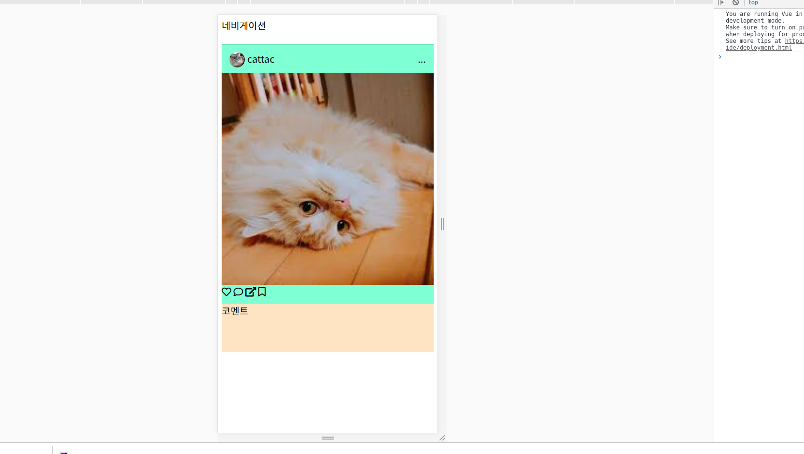
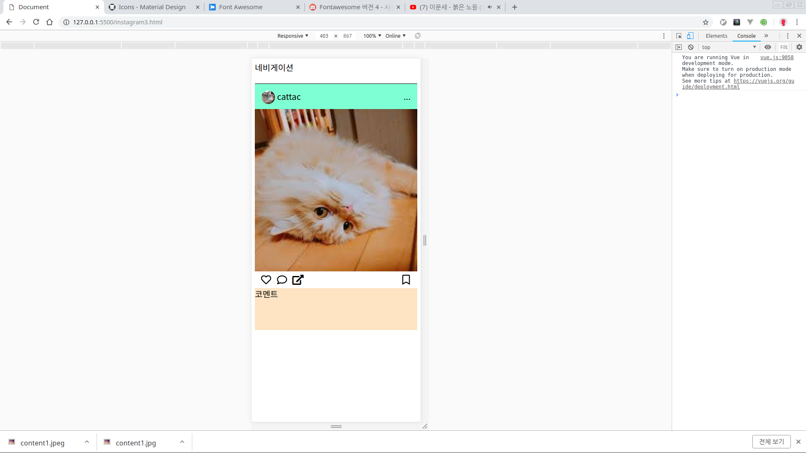

# 인스타그램 클론코딩3

## post-infor 만들기


### 구조짜기

다시 인스타그램을 확인해보자 하트와 댓글, 공유, 페이지네이션, 북마크가 있는 부분을 인포메이션이라고 하자.

* post-infor
  * post-infor-like
  * post-infor-comment
  * post-infor-share
  * post-infor-page\(이건 이번단계에선 생략한다\)
  * post-infor-bookmark

이걸 html으로 구조화 시키면 아래와 같다.

### HTML 작업

```markup
<div class="post-infor">
  <div class="post-infor-container">
    <span class="post-infor-like"></span>
    <span class="post-infor-comment"></span>
    <span class="post-infor-share"></span>
    <span class="post-infor-pages"></span>
    <span class="post-infor-bookmark"></span>
  </div>
</div>
```

### 웹 폰트 사용하기

일반적으로 우리가 자주 쓰는 아이콘들은 인터넷에 다 있다.  
하지만 이것을 이미지로 가져다 쓰면 벡터이미지가 아니면 이미지가 깨질 수도 있고 색변경도 힘들다.  
간단한 프로젝트 할 때 svg나 폰트를 만들 수는없으니깐 남의 것을 가져다 쓰자. 주로 사용되는 사이트는 다음과 같다.

* [https://material.io/tools/icons/](https://material.io/tools/icons/)
* [https://fontawesome.com/](https://fontawesome.com/)

특히 폰트어썸은 매우 유용하다. 사용법은 아래에 자세히 나와있다.

* [https://alikerock.tistory.com/59](https://alikerock.tistory.com/59)

우리는 일단 다운받지는 말고 그냥 주소를 복사해서 헤드에 넣자. 폰트어썸에서 잘 검색을 해서 아이콘을 찾았다면 복붙을 해서 넣보자.

### HTML 에 폰트어썸 추가

```markup
<head>
  ...
  <link rel="stylesheet" href="https://use.fontawesome.com/releases/v5.8.2/css/all.css"
    integrity="sha384-oS3vJWv+0UjzBfQzYUhtDYW+Pj2yciDJxpsK1OYPAYjqT085Qq/1cq5FLXAZQ7Ay" crossorigin="anonymous" />
  <script src="https://cdn.jsdelivr.net/npm/vue/dist/vue.js"></script>
</head>

...

<div class="post-infor">
  <div class="post-infor-container">
  <!-- 기존에 있는 코드를 없애고 아래 코드로 변경하자 ㅎㅎ  >
    <!-- 기존 폰트어썸에서 복붙하고 나중에 스타일을 변경하기 위해서 inforBtn클래스를 추가하자. -->
    <i class="far fa-heart inforBtn"></i>
    <i class="far fa-comment inforBtn"></i>
    <i class="fas fa-external-link-alt inforBtn"></i>
    <span class="post-infor-pages"></span>
    <i class="far fa-bookmark inforBtn"></i>
  </div>
</div>

...
```

그러면 아래와 같이 나올 것이다. 구조를 잡았으니 레이아웃을 잡아보자



### CSS 작업

```css
.post-infor {
  height: 40px;
  background-color: aquamarine;
}

.post-infor-container {
  display: flex;
  position: relative;
  /* 왼쪽과 오른쪽 공간에 조금 여백을 주자 */
  padding-left: 2%;
  padding-right: 2%;
}

.post-infor-pages {
  /* 포스트 헤드와 같다. 북마크를 오른쪽 끝으로 보내자 */
  flex-grow: 1;
}

.inforBtn {
  /* 폰트어썸을 쓰면 이미지의 크기를 font-size로 변경할 수 있다.
  왜냐하면 폰트이기 때문이다. 한번 color 속성으로 색도 변경해봐라 변경된다.*/
  /* color : red; */
  width: 38px;
  height: 38px;
  font-size: 24px;
  text-align: center;
  /* 이건 수직정렬을 위한 속성이다. 다른 방법이 많지만 제일 간단한 방법이다. */
  line-height: 40px;
}
```

## 완성



