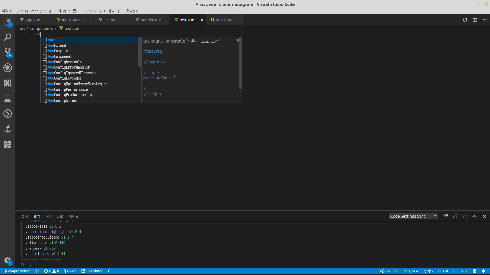

# Todo List 1

## Vue를 들어가기전에 

### 설치할 확장기능

* Vue 2 Snippets
* Vetur

### 알아야 것들

#### scaffold 또는 snippet를 이용하자.

html 작성할 떄 doc라는 snippet을 이용한다. vue에도 scf란 약어로 scaffold\(골격\)을 잡을 수 있다.  
만약 아무것도 안뜬다 하면 아래를 따라하라.




```javascript
{
	// Place your snippets for vue here. Each snippet is defined under a snippet name and has a prefix, body and
	// description. The prefix is what is used to trigger the snippet and the body will be expanded and inserted. Possible variables are:
	// $1, $2 for tab stops, $0 for the final cursor position, and ${1:label}, ${2:another} for placeholders. Placeholders with the
	// same ids are connected.
	// Example:
	"vue scaffold": {
		"prefix": "vue",
		"body": ["<template>", "", "</template>", "", "<script>", "export default {", "", "}", "</script>", "","<style scoped>","","</style>"],
		"description": "Log output to console"
	}
}
```





위에 prefix에 vue라고 설정했으니깐, 이제 vue파일에서 vue라고 하면 우리가 미리 설정한 scaffold를 사용할 수 있다.

## vue create

이제 vue cli를 사용해서 vue를 설치해보자.

vue와 node.js를 설치했다면  
vue create "project\_name"으로 프로젝트를 시작해보자.

* 공식문서
  * [https://cli.vuejs.org/guide/](https://cli.vuejs.org/guide/)
* **Vue CLI 3.0 사용하기**
  * \*\*\*\*[http://vuejs.kr/vue/vue-cli/2018/01/27/vue-cli-3/](http://vuejs.kr/vue/vue-cli/2018/01/27/vue-cli-3/)

```bash
gtah2mint@gtah2mint-X510UAR:~/Workspace/clone_instagram$ vue create "clone_instagram"


Vue CLI v3.8.2
┌───────────────────────────┐
│  Update available: 3.8.4  │
└───────────────────────────┘
? Please pick a preset: (Use arrow keys)
❯ default (babel, eslint) 
  Manually select features 
 
# spacebar를 눌러 linter / Formatter를 꺼주자.
# 좋은 기능이지만 초보자는 오히려 오류만 발생하고 귀찮다.
? Check the features needed for your project: 
 ◉ Babel
 ◯ TypeScript
 ◯ Progressive Web App (PWA) Support
 ◯ Router
 ◯ Vuex
 ◯ CSS Pre-processors
❯◯ Linter / Formatter
 ◯ Unit Testing
 ◯ E2E Testing

? Where do you prefer placing config for Babel, PostCSS, ESLint, etc.? 
  In dedicated config files 
❯ In package.json 

# 이제 걍 엔터만 치면된다.
```


그럼 아래처럼 디렉토리가 만들어 질것이다. 장고의 django-admin startproject "project name"과 같다.


이제 아래 명령어로 서버를 작동시켜보자. 장고에서 python3 manage.py runserver와 비슷한 명령어이다.

```bash
npm run serve

# 혹시 이렇게 오류가 나온다면 주소를 확인해보자.
gtah2mint@gtah2mint-X510UAR:~/Workspace/clone_instagram$ npm run serve
npm ERR! path /home/gtah2mint/Workspace/clone_instagram/package.json
npm ERR! code ENOENT
npm ERR! errno -2
npm ERR! syscall open
npm ERR! enoent ENOENT: no such file or directory, open '/home/gtah2mint/Workspace/clone_instagram/package.json'
npm ERR! enoent This is related to npm not being able to find a file.
npm ERR! enoent 

npm ERR! A complete log of this run can be found in:
npm ERR!     /home/gtah2mint/.npm/_logs/2019-06-20T05_21_43_744Z-debug.log

# 우리가 package.json이 있는 폴더에서 명령어를 실행해야 한다.
# 그래서 폴더를 수정하던가 아래처럼 폴더로 옮겨가야 한다.
gtah2mint@gtah2mint-X510UAR:~/Workspace/clone_instagram$ cd clone_instagram
gtah2mint@gtah2mint-X510UAR:~/Workspace/clone_instagram/clone_instagram$ npm run serve
# 아래처럼 나올 것이다. 아래 주소로 들어가보자 
 DONE  Compiled successfully in 3269ms                                                                                                                          14:21:30

 
  App running at:
  - Local:   http://localhost:8080/ 
  - Network: unavailable

  Note that the development build is not optimized.
  To create a production build, run npm run build.


```

아래처럼 구동되면 성공이다!!!


```markup
// src/App.vue
<template>
  <div id="app">
    <!-- 아래 코드를 지우고 hello vue를 입력해보자.
    
    <HelloWorld msg="Welcome to Your Vue.js App"/>
    -->
    Hello vue.js!!!
  </div>
</template>

```

아래와 같이 나오면 성공이다.


